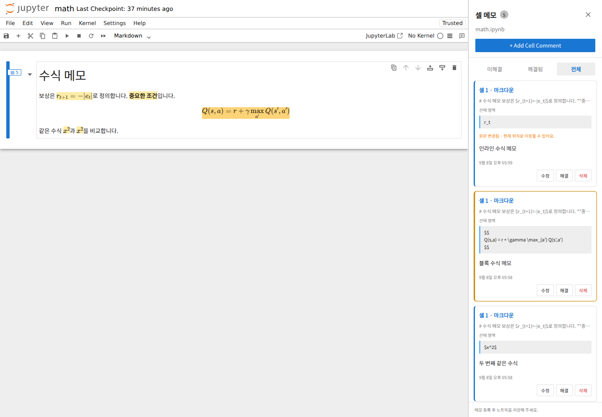

# Jupyter Notebook Comments

Word-style review comments for **Jupyter Notebook 7**. Attach comments to a whole cell, selected text or code, and Markdown formulas. Comments are stored inside the `.ipynb` file.

[한국어 안내](README.ko.md)



## Features

- Whole-cell comments and selection comments in the same notebook.
- Persistent yellow highlights; stronger emphasis for the selected comment.
- Click a highlight to open its comment. Repeated clicks cycle through overlapping comments.
- Source selection comments remain highlighted in rendered Markdown.
- Inline and display MathJax formulas receive a background highlight. Right-click a rendered formula to add a comment.
- Edit, resolve, reopen, delete, and filter comments.
- A **Toggle Comments** button at the right end of the notebook toolbar.
- No separate database, backend service, or kernel execution required.

The add actions and toolbar tooltip are in English. Other panel controls and messages currently use Korean.

## Install

Activate the **Python environment running the Jupyter server** before installing. This may differ from the kernel environment.

Clone the repository and run:

```bash
git clone https://github.com/HeoJinuk/jupyter-notebook-comments.git
cd jupyter-notebook-comments
python install.py
```

The script installs or updates the extension in the environment of the Python interpreter running it. It works on Windows, macOS, and Linux and can also be invoked by its full path from another directory. To update, download or pull the latest project and run the same command again.

For a downloaded ZIP, extract it and run `python install.py` inside the extracted folder.

When upgrading from `notebook-cell-comments`, use this script: it installs the new package first, then removes the old package to prevent duplicate extensions. Existing notebook comments keep using `cell.metadata.notebook_cell_comments` and need no conversion.

The prebuilt extension is included, so installation does not require Node.js or an npm build. pip may download the Python build dependencies during installation.

Save your notebooks, stop the Jupyter server, and start it again. Restarting only the kernel is insufficient.

```bash
jupyter notebook
jupyter labextension list
```

Check for `jupyter-notebook-comments v0.5.0 enabled OK`.
No PyPI publication is required: the script uses pip’s [local project installation](https://pip.pypa.io/en/stable/topics/local-project-installs/) workflow.

## Use

1. Right-click a cell and choose **Add Cell Comment**, or select text/code and choose **Add Comment to Selection**.
2. Write your comment in the sidebar and click **등록** (submit). `Ctrl+Enter` / `Cmd+Enter` also submits.
3. Save the notebook to persist the comment.

The sidebar's **+ Add Cell Comment** always comments on the whole active cell.
Click the rightmost comment button to open or close the sidebar. On narrow screens, toolbar items may move into the overflow menu.

For math, select LaTeX in Markdown edit mode or right-click a rendered formula. In rendered mode, the **whole formula** is highlighted, even when only part of its source was selected.

## Data and limitations

- Comments use `cell.metadata.notebook_cell_comments`, with `schemaVersion: 1`. Existing comments are preserved across these updates.
- Moving a cell keeps its comments. Deleting the cell also deletes its metadata and comments.
- Sharing the `.ipynb` also shares its comments. Recipients need this extension to see the comment UI.
- Source edits track selection positions. Deleted or ambiguous targets retain their comments and original quotes, with a location warning. Fully detached comments do not automatically reattach.
- Drafts survive closing the panel but not a page reload. Only submitted comments are saved in the notebook.
- One contiguous selection within one cell is supported. Cross-cell selections, output/plot annotations, and individual rendered math-symbol highlights are not supported.
- Custom HTML and non-default math renderers may not map reliably; the extension does not guess a location when mapping fails.
- Rendered text highlighting requires the CSS Custom Highlight API.
- Multi-user edit merging is not guaranteed. This is a personal review extension, without accounts or reply threads.
- Read-only notebooks allow viewing comments. Malformed or unsupported metadata is not overwritten.

## Development

Tested with **Notebook 7.4.4**, **JupyterLab 4.4.4 components**, Python 3.12, Node.js 24, and Chromium 149. Other versions/platforms have not been comprehensively tested.

```bash
python -m venv .venv
source .venv/bin/activate
python -m pip install "notebook==7.4.4" "jupyterlab==4.4.4" hatchling build
npm ci
npm test
npm run build
python -m build --wheel --no-isolation
pip install --upgrade .
```

On Windows, activate the environment with `.venv\Scripts\activate`.
Build the frontend before building a wheel; end users do not need Node.js.
The lockfile is included, and webpack is pinned for compatibility with the extension builder.

Source modules live in `src/`, styles in `style/`, and data/mapping tests in `tests/`. Example notebooks are in `examples/`. See [validation notes](VALIDATION.md) and the [changelog](CHANGELOG.md).

For a GitHub release, upload the wheel from `dist/` as a release asset. The repository can contain the source, lockfile, documentation, examples, and prebuilt extension. Generated dependencies, environments, and `dist/` are excluded by `.gitignore`.

## Uninstall

```bash
python -m pip uninstall jupyter-notebook-comments
```

Restart the Jupyter server. Existing comments remain in notebook metadata.

## License

[MIT](LICENSE). Bundled dependency license notices are included with the prebuilt extension.

[GitHub update instructions (Korean)](UPDATING.md)
